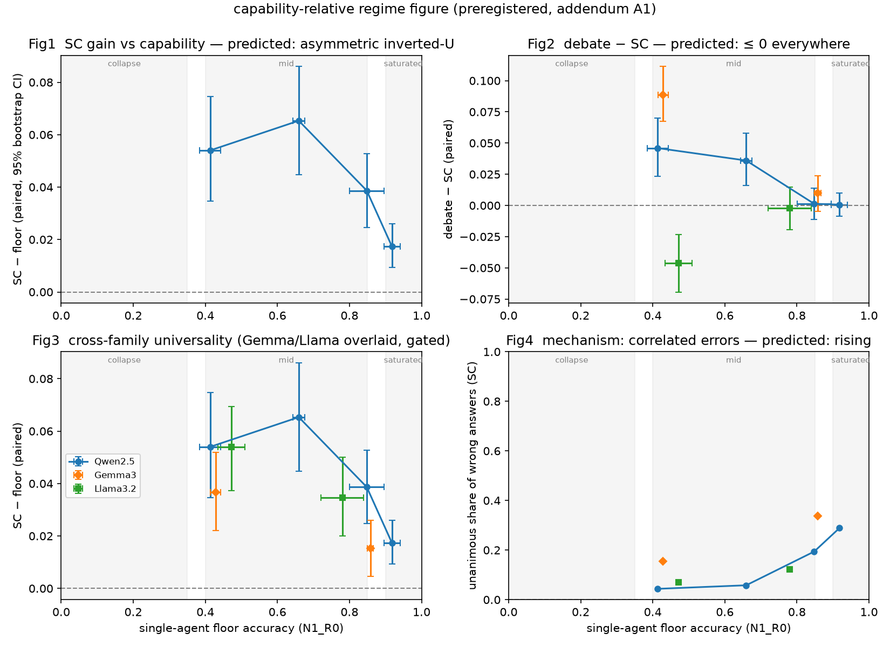

# Do multi-agent debates actually help small LLMs?

**Short answer: mostly no — once you match the compute budget.**
Debate's apparent advantage largely disappears under budget-matched comparison.
Whether it helps at all depends not on a model's absolute capability, but on its
*regime*: its capability relative to task difficulty.

## About this repo

I got curious about the sample problem in Sakana AI's Applied Engineer job
posting (it's just an illustrative example, not the real task). I started poking
at it, got curious, and ended up wanting to actually run experiments. This repo
is where all that tinkering landed.

It's a personal research log, exploratory by nature — `analysis/` and
[`experiments/phase1b_1c_regime_budget/`](experiments/phase1b_1c_regime_budget/README.md)
are where the main findings live; the other folders are just the trail I left
along the way.

Most of this was done working closely with Claude (Fable / Opus / Sonnet) — as a
sounding board for the ideas, a pair for the code, and a second pass on the
writing. Less "AI did it," more thinking out loud with a fast collaborator.

## TL;DR

- Compared multi-agent **debate** vs. budget-matched **self-consistency (SC)** on
  GSM8K, across Gemma / Llama / Qwen families (0.5B–7B).
- When debate and SC get the *same* inference budget, debate's edge mostly
  vanishes. Some earlier "debate wins" results look partly like a budget artifact.
- What predicts whether debate helps is **regime** — capability relative to task
  difficulty — not absolute model size or score. (capability-relative regime
  hypothesis)
- Pre-registered design. The phase diagram plots outcomes against floor accuracy.

**Full write-ups (what was run, how to reproduce it, every number and figure):**
- [Phase 1 — the original N×R debate grid](experiments/phase1_grid/README.md)
- [Part 1b + 1c + Part 2 Step 0 — regime identification, budget-fair rerun, label-free estimation](experiments/phase1b_1c_regime_budget/README.md)

## Phase diagram



x-axis is floor accuracy (a proxy for how hard the task is for that model).
Whether debate helps, hurts, or does nothing lines up with regime rather than
with raw model size.

## When debate hurts: Llama losing correct answers

For Llama models, debate sometimes *lowered* accuracy. Looking at individual
problems, the rate of **abandoning a correct answer** under peer pressure
exceeded the rate of **fixing a wrong one** — so debate washed out more than it
repaired. Debate isn't neutral when a model is in the wrong regime.

<!-- TODO (optional): add measured numbers, e.g. abandon X% vs. correct Y% -->

## Setup

- **Task:** GSM8K
- **Models:** Gemma / Llama / Qwen families, 0.5B–7B
- **Compared:** multi-agent debate vs. self-consistency, matched on inference
  budget (so the comparison isn't just "debate spends more compute")
- **Design:** pre-registered
- **Infra:** single L4 spot VM on GCP, vLLM for inference

## Repo layout

| path | what's in it |
| --- | --- |
| [`experiments/phase1_grid/`](experiments/phase1_grid/README.md) | Phase 1 — the original N×R debate grid, single Qwen2.5-7B: config, raw results, the superseded maxtok512 archive, and figures |
| [`experiments/phase1b_1c_regime_budget/`](experiments/phase1b_1c_regime_budget/README.md) | Part 1b (regime identification) + Part 1c (budget-fair comparison), multi-model (Qwen/Gemma/Llama, 0.5B–7B). 1b and 1c intentionally share the same per-model result dir (paired McNemar testing), so they live together |
| `code/` | runners (`run_debate.py`, `run_baseline.py`) plus all analysis/plotting scripts — shared across Phase 1, Part 1b/1c, and Part 2 |
| `analysis/` | Phase 1's own aggregate script (`analyze.py`) |
| `scripts/` | glue scripts (progress checking) |

Part 2 (label-free regime estimation, exchange-rate table) has no result dir of
its own — its scripts in `code/` read directly from
`experiments/phase1b_1c_regime_budget/results/`.

## How this sits next to prior work

This isn't the first look at debate vs. simpler test-time compute — a few pieces
point the same direction, and this repo is my own hands-on check of that ground:

- **Choi et al., *Debate or Vote* (NeurIPS 2025)** — questions when debate beats
  simple voting.
- **Hu et al., *Statistical Scouting* (Amazon)** — budget-aware view of
  multi-sample methods.
- **Snell et al., *Compute-Optimal Test-Time Scaling* (ICLR 2025)** — how to
  spend a fixed inference budget well.

The angle here: hold budget fixed, then ask *when* debate is the right way to
spend it — framed around regime.

## Reproduce

Requires a local vLLM server serving the model named in the config's `base_url`/`model`.

```bash
python code/run_debate.py experiments/phase1b_1c_regime_budget/config/config_regime_gemma1b.yaml
python code/analyze_regime.py
```
