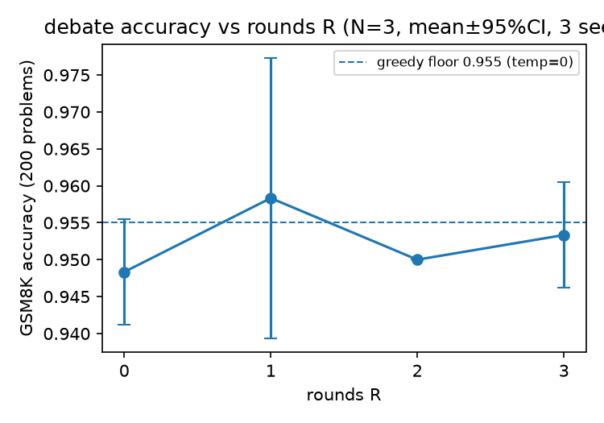
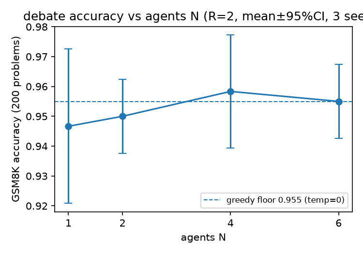

# Phase 1 — the original N×R debate grid

Single model (Qwen2.5-7B-Instruct), GSM8K, 200-problem subset. Sweep the
debate grid directly: N agents × R rounds. This is the first thing that got
run in this project, before the regime framing existed — its job was to
establish whether debate helps *at all* here, and it's what motivated
everything that came after.

## What this is doing

- **Task:** GSM8K, 200-problem subset (`data/gsm8k_subset.jsonl`)
- **Model:** Qwen2.5-7B-Instruct (single model, no cross-family comparison yet)
- **Grid:** 9 (N, R) conditions × 3 seeds — an R-curve at fixed N=3 (R=0..3)
  and an N-curve at fixed R=2 (N=1,2,3,4,6)
- **Two runs kept:** `archive_maxtok512/` (max_tokens=512, superseded — answers
  were getting truncated mid-round) and `results/` (max_tokens=1024, the
  final numbers below)

## How to run

From the repo root:

```bash
# generate the debate grid (writes into results/)
python code/run_debate.py experiments/phase1_grid/config.yaml

# single-shot greedy baseline (191/200 = 0.955, the dashed floor line in the figures)
# note: run_baseline.py uses bare filenames, so it must be run with this
# folder's data/ as cwd
cd experiments/phase1_grid/data && python ../../../code/run_baseline.py && cd -
python code/regrade_baseline.py   # regrades data/baseline_results.jsonl after an extract() bugfix

# aggregate + plot (writes into figures/)
python analysis/analyze.py
```

## What we found

**The task is saturated for a 7B instruct model — debate has nowhere to
show an effect.** Accuracy sits in a 1.5-point band (0.943–0.958) across all
9 conditions, and McNemar on the paper's headline comparison (debate N3_R2 vs
self-consistency N3_R0) is a dead heat: **9 wins vs 8 wins, p = 1.00.**
Nothing survives multiple-comparison correction against the floor either.

- **Debate rounds trend accuracy *down*, not up** — N3_R2 goes
  0.960 → 0.955 → 0.950 round over round. No condition shows net improvement
  from arguing longer.
- **60–80% of wrong answers are unanimous** — every agent converges on the
  *same* wrong answer. The same 7 problems fail in nearly all 27 runs;
  digging into them, most are genuine dataset noise (a mislabeled gold
  answer, a self-contradictory problem statement, ambiguous phrasing that
  every agent reads the same "wrong" way). Debate can't fix an error the
  whole ensemble agrees on — it just re-confirms it.
- **Practical upshot:** at this capability level relative to task difficulty,
  the ~1% "ceiling" is mostly irreducible label noise, not headroom debate
  could claim. This is what motivated the regime framing in
  [`../phase1b_1c_regime_budget/`](../phase1b_1c_regime_budget/README.md) —
  if debate only shows an effect somewhere between "too easy" and "too hard,"
  a single saturated 7B model can't see it.

### R-curve (fixed N=3, rounds 0–3)



### N-curve (fixed R=2, agents 1–6)



Both curves sit flat inside the CI band around the greedy floor (dashed
line, 0.955) — no significant trend in either direction.
