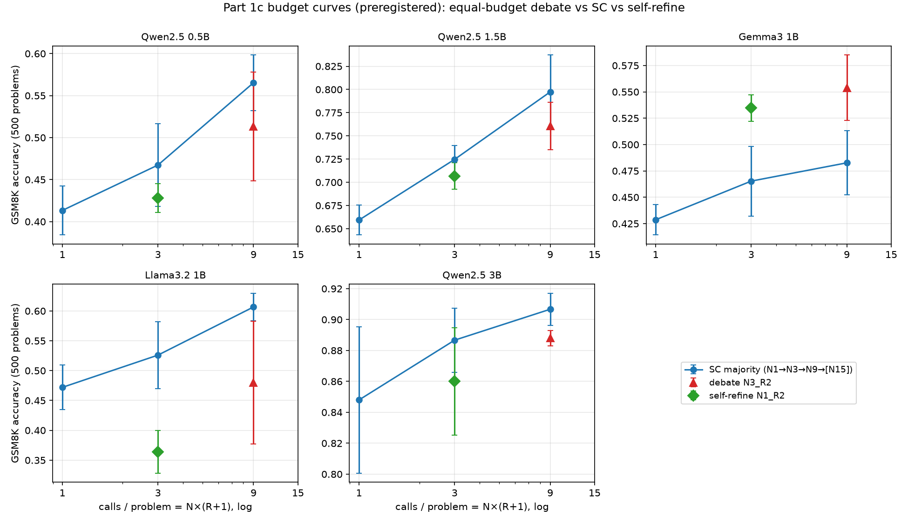
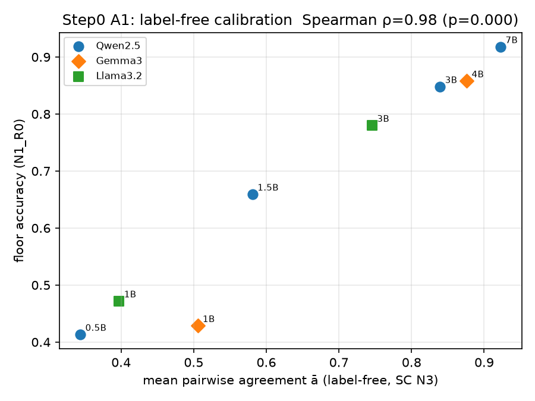
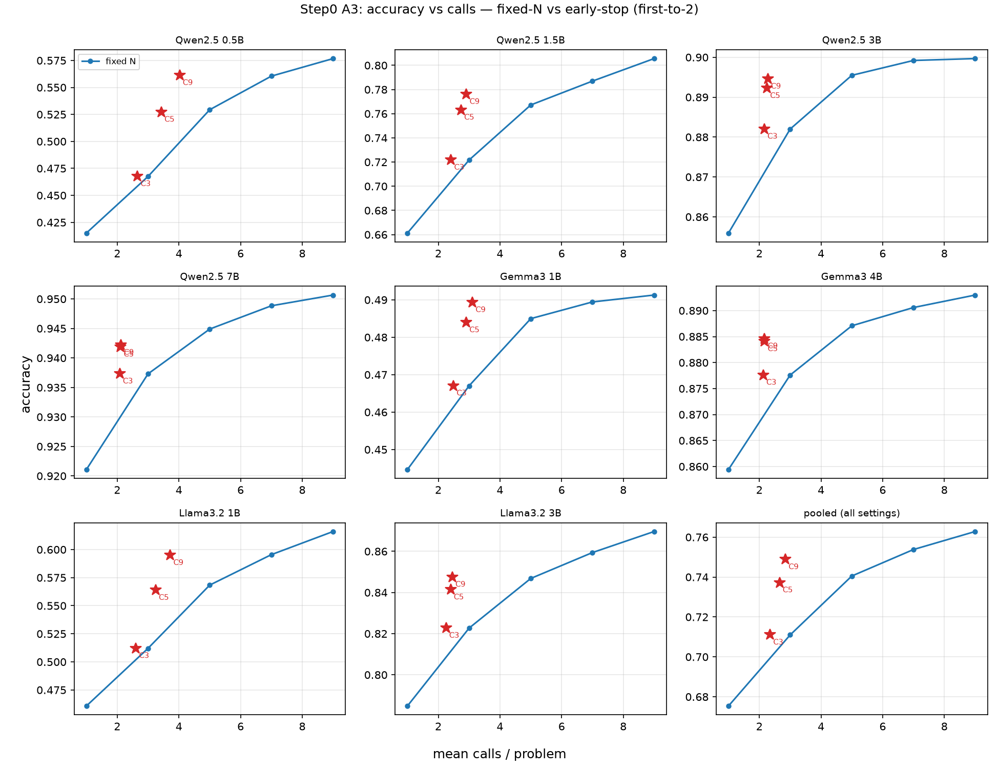
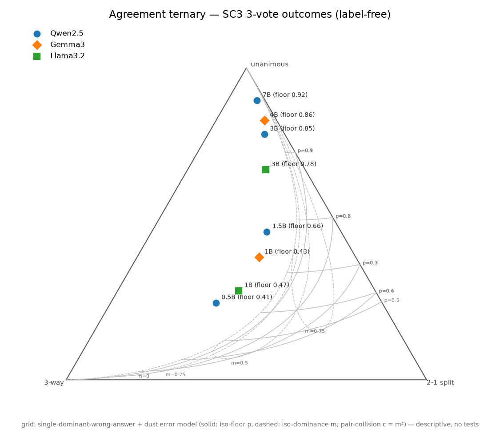
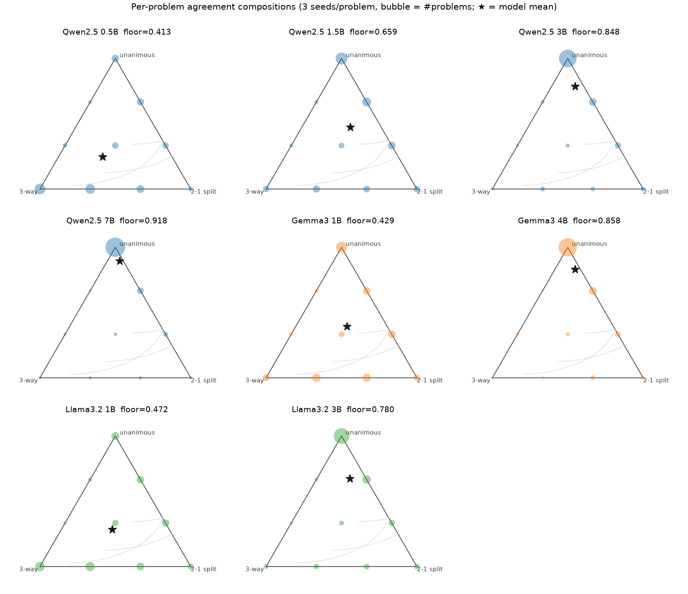

# Part 1b + 1c + Part 2 Step 0 — regime identification, budget-fair rerun, and label-free estimation

Multi-model, multi-family: Qwen2.5 {0.5B, 1.5B, 3B, 7B}, Gemma-3 {1B, 4B},
Llama-3.2 {1B, 3B}, same 500-problem GSM8K subset throughout
(`data/gsm8k_subset_regime.jsonl`). This is where the main findings of the
project live. Three analyses share this folder because they intentionally
share the same per-model result files (Part 1c reuses Part 1b's floor/SC/debate
runs for the same seeds, so the paired statistical tests stay valid) —
splitting them into separate folders would have broken that pairing.

## What this is doing

- **Part 1b** — does debate beat self-consistency (SC), and does that depend
  on *regime* (capability relative to task difficulty, proxied by floor
  accuracy) rather than raw model size? Debate (N3_R2, 9 calls/problem) vs SC
  (N3_R0, 3 calls/problem) vs floor (N1_R0, 1 call/problem) — **budget is not
  matched between debate and SC here**, which 1b itself flags as an open
  caveat.
- **Part 1c** — closes that caveat: rerun at matched budget. Debate (N3_R2, 9
  calls) vs SC9 (N9_R0, 9 calls) vs self-refine (N1_R2, 3 calls, one agent
  revising its own answer with no peer information at all).
- **Part 2 Step 0** — can regime be read off *without* gold labels at all,
  using only how often 3 independent samples agree with each other? Feeds a
  compute-allocation policy (answer early when votes agree, escalate when
  they don't).
- **Bonus, exploratory, unregistered** — ternary consensus diagrams
  (`plot_agreement_ternary.py`, `fit_ternary_mixture.py`): plotting each
  model's {all-agree / 2-1 split / all-different} outcome mix as a point in a
  triangle, no grading involved.

## How to run

From the repo root. Data prep (`gsm8k_subset_regime.jsonl`) is already
committed — regenerating it isn't necessary unless you want to change the
sampling:

```bash
python code/make_subset_regime.py   # writes experiments/phase1b_1c_regime_budget/data/gsm8k_subset_regime.jsonl
```

**Part 1b** — floor / SC / debate for each of the 8 models (unequal budget):

```bash
for cfg in experiments/phase1b_1c_regime_budget/config/config_regime_*.yaml; do
  python code/run_debate.py "$cfg"
done
# 7B floor/SC/debate is reused from Phase 1 instead of rerun from scratch:
python code/seed_7b_reuse.py
python code/analyze_regime.py       # -> fig_regime.png, fig_regime_raw.png
```

**Part 1c** — SC9 + self-refine for the 5 core models (budget-fair):

```bash
for cfg in experiments/phase1b_1c_regime_budget/config/config_budget_*.yaml; do
  python code/run_debate.py "$cfg"
done
python code/analyze_budget.py       # -> fig_budget.png
```

**Part 2 Step 0** (label-free, $0, CPU only — reuses the Part 1b/1c logs, no new inference):

```bash
python code/analyze_part2_step0.py  # -> fig_step0_calibration.png, fig_step0_pareto.png, fig_step0_escalation.png
```

**Exploratory bonus** (also label-free, $0):

```bash
python code/plot_agreement_ternary.py   # -> fig_ternary_main.png, fig_ternary_models.png
python code/fit_ternary_mixture.py      # -> fig_ternary_mixfit.png
```

Part 2 Step 1 (`code/analyze_part2_step1.py`, the "exchange-rate table" of
regime → best use of a fixed compute budget) is drafted but its
pre-registration sign-off is still pending — its figures
(`fig_step1_*.png`) exist from a preview run, not a confirmed analysis, so no
findings from it are reported below yet.

## What we found

### Part 1b — a debate>SC band exists, but its sign depends on model family

| model | floor | SC (3 calls) | debate (9 calls) |
|---|---|---|---|
| Qwen 0.5B | 0.413 | 0.467 | 0.513 |
| Qwen 1.5B | 0.659 | 0.725 | 0.761 |
| Qwen 3B | 0.848 | 0.887 | 0.888 |
| Qwen 7B | 0.918 | 0.935 | 0.936 |
| Gemma-3 1B | 0.429 | 0.465 | 0.554 |
| Gemma-3 4B | 0.858 | 0.873 | 0.883 |
| Llama-3.2 1B | 0.472 | 0.526 | 0.480 |
| Llama-3.2 3B | 0.780 | 0.815 | 0.813 |

- **SC beats floor everywhere**, by an amount that rises then decays with
  floor accuracy (+5.4 → +6.5 → +3.9 → +1.7pt for Qwen) — consistent with a
  regime effect, and mechanistically explained by errors becoming more
  *correlated* as models get stronger (unanimous-wrong rate climbs from 4.4%
  at the weakest Qwen to 28.9% at the strongest — once every agent makes the
  same mistake, majority voting can't fix it).
- **Debate beats SC only in a floor band of ~0.41–0.66**, and only for
  Qwen (+4.6pt at 0.5B, +3.6pt at 1.5B, both Holm p<0.01); it's flat at
  higher floor accuracy. But — same band, opposite signs by family: **Gemma-3
  1B +8.9pt, Qwen 0.5B +4.6pt, Llama-3.2 1B −4.6pt**, all individually
  significant. Same regime, three different outcomes depending on which
  model family you picked.
- **Caveat this section can't resolve on its own:** debate spends 3× the
  compute of SC here (9 calls vs 3). Part 1c exists specifically to check
  whether the above is a real interaction effect or just "more samples wins."


### Part 1c — under equal budget, the debate advantage mostly reverses

| model | floor (1) | SC3 (3) | self-refine (3) | debate (9) | SC9 (9) |
|---|---|---|---|---|---|
| Qwen 0.5B | 0.413 | 0.467 | 0.428 | 0.513 | **0.565** |
| Qwen 1.5B | 0.659 | 0.725 | 0.707 | 0.761 | **0.797** |
| Qwen 3B | 0.848 | 0.887 | 0.860 | 0.888 | **0.907** |
| Gemma-3 1B | 0.429 | 0.465 | 0.535 | **0.554** | 0.483 |
| Llama-3.2 1B | 0.472 | 0.526 | 0.364 | 0.480 | **0.607** |

Numbers in **bold** are the best condition per model at that budget.

- **For Qwen and Llama, "debate > SC" from Part 1b turns out to be a budget
  artifact.** At matched budget (debate's 9 calls vs SC9's 9 calls), debate
  *loses*, significantly: Qwen 0.5B −5.2pt, Qwen 1.5B −3.7pt, Qwen 3B −1.9pt,
  **Llama 1B −12.7pt** (all Holm p ≤ 0.003). Give a small model 9 independent
  tries instead of a 3-agent argument and it does better every time.
- **Gemma-3 1B is the one model where debate still wins**, and by more than
  sampling alone could explain: debate 0.554 vs SC9 0.483 (+7.1pt, Holm
  p<0.001), and a Monte Carlo simulation of the SC voting-limit ceiling tops
  out at 0.503 [0.458, 0.548] — debate's 0.554 is outside the range more
  votes could ever reach. This is the one genuine "interaction effect"
  found in the whole project.
- **...but most of that gain is self-refinement, not multi-agent debate.**
  Self-refine alone (one agent revising its own answer, 3 calls, no peer
  input) already scores 0.535 — about 80% of debate's total gain over SC3,
  for a third of the compute. Debate's remaining edge over self-refine alone
  is only +1.9pt for 3× the calls — a descriptive comparison, not a
  registered/tested one, but it's small either way.
- **Llama's problem isn't peer pressure, it's regeneration itself.**
  Self-refine — with *no other agent's answer visible at all* — already
  drops −10.8pt from floor. Debate (0.480) is actually higher than
  self-refine alone (0.364): having other agents' answers to react to
  partially *buffers* Llama's instability rather than causing it.
- **Net picture per family:** Qwen's best use of extra compute is plain
  sampling; Gemma's is self-refinement; Llama's is sampling too (its
  "refine" instinct actively hurts it). There's no universal answer to "is
  debate worth it" — it depends on which model you're running.



### Part 2 Step 0 — regime can be read off without any gold labels

Using only how often 3 independent samples agree with each other (no answer
grading, $0 in new inference — this reuses the Part 1b/1c logs):

- **Floor accuracy is predictable from agreement rate alone**: Spearman
  ρ = 0.976 across all 8 models, leave-one-out mean absolute error = 6.0
  points. You can tell roughly how capable a model is on a task just by
  sampling it 3 times and counting how often it agrees with itself.
- **Per-problem agreement predicts per-problem correctness** too (AUC
  0.79–0.88 across all 8 models) — good enough to drive a real policy.
- **Early stopping works**: answer immediately when 2 of 3 samples agree,
  only pay for a 3rd sample when they split. This cuts the call budget by
  ~22% with no measured accuracy loss.
- One caveat carried through from the calibration curve: agreement
  systematically *over-reads* Gemma's real accuracy, because Gemma's errors
  are more correlated than Qwen's/Llama's at the same floor — a single
  calibration curve isn't safe across families without a per-family
  correction (see the ternary diagrams below for why).




### Bonus: ternary consensus diagrams (exploratory, unregistered)

Plotting each model's {all-agree, 2-1 split, all-different} outcome mix as a
single point inside a triangle — still zero grading involved:



Three models sit at nearly the same floor accuracy (Qwen 0.5B 0.413, Llama 1B
0.472, Gemma 1B 0.429) but land in completely different places on the
triangle: **Gemma clusters near the "all agree" corner** (its errors are
correlated — when it's wrong, all 3 samples tend to be wrong the *same* way),
while **Qwen 0.5B pulls toward "all different"** (its errors scatter). This
is a direct, label-free picture of *why* the calibration curve overshoots for
Gemma — the same underlying fact (correlated errors) that made majority
voting decay for stronger models in Part 1b shows up here as a family
"temperament" visible without ever checking an answer.


